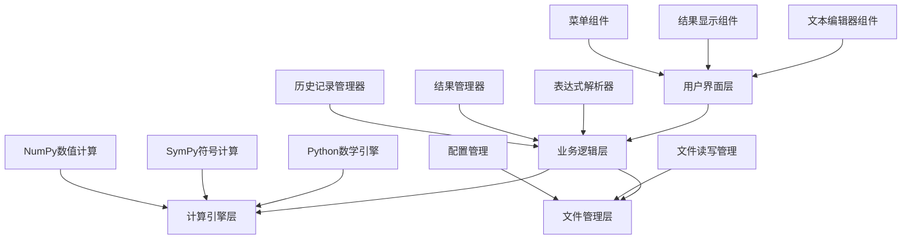
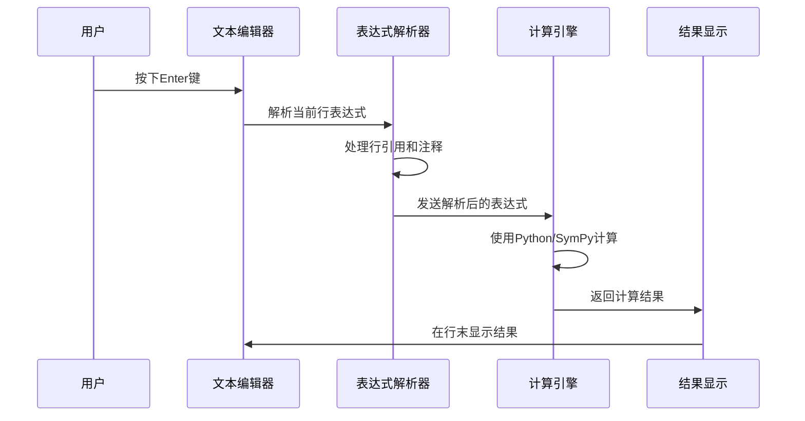

# Python 计算器软件设计文档

## 1. 概述

本项目是一个基于Python开发的高级计算器软件，使用Python内置数学库和第三方科学计算库提供强大的数学计算能力。软件采用文本编辑器样式的用户界面，支持多行输入、结果引用、方程求解等高级功能。

### 核心特性
- 实时计算显示结果
- 支持解方程和多解显示
- 行间结果引用功能
- 注释支持
- 计算历史保存
- 类文本编辑器界面

## 2. 技术栈与依赖

### 主要技术栈
- **编程语言**: Python 3.8+
- **计算引擎**: math, numpy, sympy
- **GUI框架**: tkinter (内置)
- **科学计算**: numpy, scipy
- **符号计算**: sympy (方程求解)
- **文本处理**: re (正则表达式)
- **文件操作**: os, json

### 依赖库
```
numpy>=1.21.0
sympy>=1.9.0
scipy>=1.7.0
tkinter (Python内置)
math (Python内置)
re (Python内置)
json (Python内置)
os (Python内置)
```

## 3. 系统架构

### 3.1 架构概述



### 3.2 模块结构

```
calculator/
├── main.py              # 主程序入口
├── gui/
│   ├── __init__.py
│   ├── main_window.py   # 主窗口
│   ├── text_editor.py   # 文本编辑器组件
│   └── result_display.py # 结果显示组件
├── core/
│   ├── __init__.py
│   ├── calculator.py    # 计算引擎包装
│   ├── parser.py        # 表达式解析
│   └── result_manager.py # 结果管理
├── utils/
│   ├── __init__.py
│   ├── file_manager.py  # 文件操作
│   └── config.py        # 配置管理
└── tests/
    ├── test_calculator.py
    ├── test_parser.py
    └── test_file_manager.py
```

## 4. 核心组件设计

### 4.1 用户界面层

#### 主窗口组件 (MainWindow)
```
类: MainWindow
职责: 
- 管理整个应用程序窗口
- 协调各个子组件
- 处理菜单操作

主要方法:
- initialize_ui() # 初始化界面
- setup_menu() # 设置菜单
- handle_file_operations() # 文件操作处理
```

#### 文本编辑器组件 (TextEditor)
```
类: TextEditor
职责:
- 提供多行文本输入
- 处理键盘事件 (Enter, Shift+Enter)
- 语法高亮显示
- 行号显示

主要方法:
- on_key_press(event) # 键盘事件处理
- calculate_current_line() # 计算当前行
- calculate_all_lines() # 计算所有行
- highlight_syntax() # 语法高亮
```

#### 结果显示组件 (ResultDisplay)
```
类: ResultDisplay
职责:
- 在每行末尾显示计算结果
- 处理多解显示格式
- 错误信息显示

主要方法:
- display_result(line_num, result) # 显示结果
- format_multiple_solutions(solutions) # 格式化多解
- show_error(line_num, error) # 显示错误
```

### 4.2 业务逻辑层

#### 表达式解析器 (ExpressionParser)
```
类: ExpressionParser
职责:
- 解析用户输入的表达式
- 处理行引用 (@3, @3.0)
- 过滤注释 (#)
- 验证表达式合法性

主要方法:
- parse_expression(text) # 解析表达式
- resolve_line_references(expr, results) # 解析行引用
- remove_comments(text) # 移除注释
- validate_syntax(expr) # 验证语法
```

#### 结果管理器 (ResultManager)
```
类: ResultManager
职责:
- 管理计算结果历史
- 提供结果查询接口
- 处理结果格式化

主要方法:
- store_result(line_num, result) # 存储结果
- get_result(line_num, index=None) # 获取结果
- get_all_results() # 获取所有结果
- format_result(result) # 格式化结果
```

### 4.3 计算引擎层

#### 计算器包装类 (CalculatorEngine)
```
类: CalculatorEngine
职责:
- 封装Python数学计算功能
- 集成numpy、sympy计算能力
- 处理不同类型的计算
- 方程求解
- 错误处理

主要方法:
- calculate(expression) # 基本计算 (使用eval)
- solve_equation(equation) # 求解方程 (使用sympy)
- evaluate_function(func) # 函数计算
- calculate_numpy(expr) # 数值计算
- handle_calculation_error(error) # 错误处理
```

## 5. 关键功能实现

### 5.1 实时计算显示



### 5.2 行引用系统

#### 引用格式处理
- `@3`: 引用第3行的完整结果
- `@3.0`: 引用第3行结果的第一个解
- `@3.1`: 引用第3行结果的第二个解

#### 实现逻辑
```
引用解析流程:
1. 正则表达式匹配 @行号[.索引]
2. 从结果管理器获取对应结果
3. 替换表达式中的引用
4. 递归处理嵌套引用
```

### 5.3 方程求解与多解显示

#### 多解格式示例
```
输入: solve(x^2 - 5*x + 6 = 0, x)
输出: x[0] = 2, x[1] = 3
```

#### 处理逻辑
```
方程求解流程:
1. 识别方程表达式
2. 使用SymPy的solve函数求解
3. 解析多个解
4. 格式化为 x[i] = value 形式
5. 存储每个解供后续引用
```

### 5.4 键盘事件处理

#### 事件映射
- `Enter`: 计算当前行
- `Shift + Enter`: 计算所有行
- `Ctrl + S`: 保存计算书
- `Ctrl + O`: 打开计算书

## 6. 数据模型

### 6.1 计算结果数据结构

```
ResultData:
{
    "line_number": int,
    "expression": str,
    "result": Union[str, List[str]],
    "result_type": str, # "single", "multiple", "error"
    "timestamp": datetime,
    "is_equation": bool
}
```

### 6.2 计算书文件格式

```
CalculatorDocument:
{
    "version": "1.0",
    "created_at": datetime,
    "modified_at": datetime,
    "content": [
        {
            "line": int,
            "text": str,
            "result": ResultData
        }
    ],
    "settings": {
        "precision": int,
        "angle_unit": str,
        "number_format": str
    }
}
```

## 7. 文件管理

### 7.1 保存功能
- **文件格式**: JSON格式保存完整计算过程
- **自动保存**: 定期自动保存防止数据丢失
- **版本控制**: 保留历史版本记录

### 7.2 加载功能
- **格式验证**: 验证文件格式完整性
- **向下兼容**: 支持旧版本文件格式
- **错误恢复**: 部分损坏文件的恢复机制

## 8. 用户体验设计

### 8.1 界面布局

```
┌─────────────────────────────────────────────────────┐
│ 文件(F) 编辑(E) 视图(V) 工具(T) 帮助(H)                │
├─────────────────────────────────────────────────────┤
│ 行号 │ 表达式输入区域                    │ 结果显示区 │
│  1   │ 2 + 3                           │ = 5       │
│  2   │ @1 * 4                          │ = 20      │
│  3   │ solve(x^2 - 5*x + 6 = 0, x)     │ x[0]=2... │
│  4   │ # 这是注释                        │           │
│  5   │ @3.0 + @3.1                     │ = 5       │
│      │                                 │           │
├─────────────────────────────────────────────────────┤
│ 状态栏: 就绪 | 行: 5, 列: 12 | 精度: 10位              │
└─────────────────────────────────────────────────────┘
```

### 8.2 交互设计
- **即时反馈**: 输入时实时语法检查
- **错误提示**: 友好的错误信息显示
- **快捷操作**: 常用功能快捷键支持

## 10. 计算引擎实现方案

### 10.1 基础数学计算

#### 使用Python内置功能
```
支持的运算:
- 基本四则运算: +, -, *, /, //, %, **
- 数学函数: sin, cos, tan, log, exp, sqrt
- 常数: pi, e
- 复数运算

实现方式:
- 使用eval()函数进行安全计算
- 预定义安全的命名空间
- 导入math模块的常用函数
```

#### 安全计算实现
```python
import math
import cmath

# 安全的计算命名空间
safe_dict = {
    '__builtins__': {},
    'abs': abs, 'round': round, 'min': min, 'max': max,
    'sum': sum, 'pow': pow,
    # math模块函数
    'sin': math.sin, 'cos': math.cos, 'tan': math.tan,
    'asin': math.asin, 'acos': math.acos, 'atan': math.atan,
    'sinh': math.sinh, 'cosh': math.cosh, 'tanh': math.tanh,
    'log': math.log, 'log10': math.log10, 'exp': math.exp,
    'sqrt': math.sqrt, 'factorial': math.factorial,
    'pi': math.pi, 'e': math.e,
    # 复数支持
    'j': 1j, 'complex': complex
}
```

### 10.2 方程求解实现

#### 使用SymPy库
```python
import sympy as sp

# 方程求解示例
def solve_equation(equation_str):
    # 解析方程字符串
    x = sp.Symbol('x')
    equation = sp.sympify(equation_str)
    
    # 求解方程
    solutions = sp.solve(equation, x)
    
    # 格式化输出
    if len(solutions) == 1:
        return f"x = {solutions[0]}"
    else:
        result = []
        for i, sol in enumerate(solutions):
            result.append(f"x[{i}] = {sol}")
        return ", ".join(result)
```

#### 支持的方程类型
```
- 线性方程: 2*x + 3 = 7
- 二次方程: x**2 - 5*x + 6 = 0
- 高次方程: x**3 - x**2 - x + 1 = 0
- 三角方程: sin(x) = 0.5
- 指数方程: exp(x) = 10
- 对数方程: log(x) = 2
```

### 10.3 高级数学功能

#### 使用NumPy进行数值计算
```python
import numpy as np

# 支持的NumPy功能
numpy_functions = {
    'array': np.array,
    'linspace': np.linspace,
    'mean': np.mean,
    'std': np.std,
    'sum': np.sum,
    'dot': np.dot,
    'cross': np.cross
}
```

#### 特殊函数支持
```python
from scipy import special

# 特殊数学函数
special_functions = {
    'gamma': special.gamma,
    'beta': special.beta,
    'erf': special.erf,
    'bessel': special.jv
}
```

### 10.4 表达式解析增强

#### 智能表达式识别
```python
def classify_expression(expr):
    """
    分类表达式类型
    """
    if '=' in expr and 'solve' not in expr:
        return 'equation'  # 方程
    elif any(func in expr for func in ['solve', 'diff', 'integrate']):
        return 'symbolic'  # 符号计算
    elif 'array' in expr or '[' in expr:
        return 'array'     # 数组运算
    else:
        return 'numeric'   # 数值计算
```

#### 多种计算模式
```python
def calculate_expression(expr, mode='auto'):
    """
    根据模式选择计算方式
    """
    if mode == 'auto':
        mode = classify_expression(expr)
    
    if mode == 'equation':
        return solve_with_sympy(expr)
    elif mode == 'symbolic':
        return symbolic_calculate(expr)
    elif mode == 'array':
        return numpy_calculate(expr)
    else:
        return basic_calculate(expr)
```

## 11. 测试策略

### 11.1 单元测试
- **计算引擎测试**: 验证各种数学表达式计算
- **解析器测试**: 测试表达式解析和引用处理
- **文件管理测试**: 测试保存和加载功能

### 11.2 集成测试
- **端到端测试**: 完整用户操作流程测试
- **界面测试**: GUI组件交互测试
- **性能测试**: 大量计算的性能验证

### 11.3 测试用例示例
```
测试计算功能:
- 基本四则运算
- 复杂数学函数
- 方程求解
- 行引用计算
- 错误表达式处理

测试界面功能:
- 键盘事件响应
- 结果显示格式
- 文件操作流程
- 注释显示效果
```